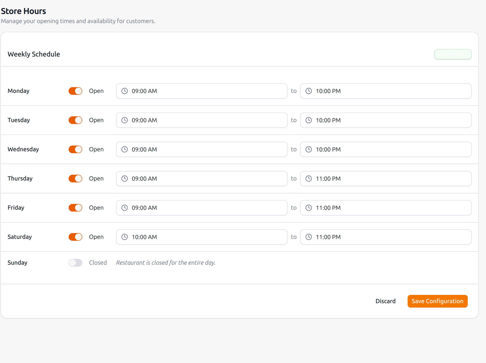

# Know Bugs

- While ordering zone is not being attached to the order which is necessary to deliver the order to the customer. This is because of the missing relation between order and zone in the database. This is a critical bug and needs to be fixed as soon as possible.

- The system is not sending order confirmation emails to customers after placing an order. This is a critical bug as it affects customer experience and trust in the system.

- Generate an order ID for each order to ensure uniqueness and easy tracking. This is important for both customers and the restaurant to manage orders effectively.

- Pagination is not implemented in the API responses for products and orders. This can lead to performance issues and difficulties in managing large datasets. Implementing pagination will improve the efficiency of data retrieval and enhance user experience.

- The API does not currently support filtering products by category or price range. This is a useful feature for customers to find products that meet their preferences and budget. Adding filtering options will enhance the usability of the product catalog.

- Image upload functionality for products and category. This is important for visually appealing product listings and better customer engagement. Implementing image upload will allow merchants to showcase their products more effectively.

- The API does not currently support updating or deleting products, categories, and orders. This is a critical feature for merchants to manage their inventory and orders effectively. Implementing update and delete functionality will enhance the flexibility and usability of the system.

-  The API does not currently support proper managing store hours for restaurants. This is important for customers to know when the restaurant is open and can accept orders. Implementing store hours management will improve customer experience and help restaurants manage their operations more effectively. See the image above for an example of how store hours can be displayed on the frontend.

- Add a query param to filter orders by status (e.g., pending, completed, cancelled). This will allow merchants to easily manage and track their orders based on their current status. Implementing order status filtering will enhance the efficiency of order management for merchants.

- Add a query param to orders listing endpoint to include items details in the response. This will provide merchants with more comprehensive information about each order, including the products ordered, quantities, and prices. Implementing this feature will improve the visibility of order details and help merchants manage their orders more effectively.

- Add support for currency to configure it merchant-wise and include it in the API responses. This will allow merchants to display prices in their preferred currency and provide a better shopping experience for customers. Implementing currency support will enhance the flexibility and usability of the system for merchants operating in different regions.
